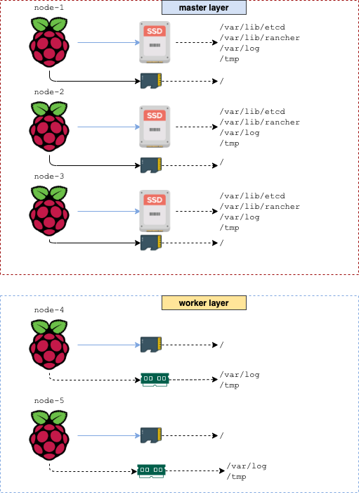

# ansible-k3s-raspberry

Build a Raspberry Pi Kubernetes cluster using Ansible with k3s. It works under `Ubuntu 21.04`, and probably some other recent Ubuntu/Debian versions.
This Role runs some hardening for the SSH service, creates the CA certificate and node certificates, installs etcd and creates the cluster.

## Working environment

This Role is used to bootstrap my local 5 nodes Raspberry Pi Cluster under `Ubuntu 21.04`, and it isn't supposed to be working on yours without changing some of the logic.


Each of the master nodes has an SSD disk attached to it (by using the USB 3.0 interface in the Raspberry Pi), all the other workers nodes only uses the SD card and all the I/O intensive operations (like log writting, or the K3s datadir has been moved to `tmpfs`).



## Installation

#### Edit the inventory

Add your Pubic SSH to desired hosts in order to enable Ansible to login, then edit the inventory (`hosts.ini`):

```ini
[master]
node-1.k3s.tty0.guru ansible_ssh_host=192.168.5.1 target_ip=192.168.5.201/24
node-2.k3s.tty0.guru ansible_ssh_host=192.168.5.2 target_ip=192.168.5.202/24
node-3.k3s.tty0.guru ansible_ssh_host=192.168.5.3 target_ip=192.168.5.203/24

[worker]
node-4.k3s.tty0.guru ansible_ssh_host=192.168.5.4 target_ip=192.168.5.204/24
node-5.k3s.tty0.guru ansible_ssh_host=192.168.5.5 target_ip=192.168.5.205/24

[k3s_cluster:children]
master
worker
```
It has two IP addresses:
* `ansibe_ssh_host` is the IP address assigned to the host
* `target_ip` is the desired IP address for the host.

After the first execution, the `ansible_ssh_host` will be updated to the value of `taget_ip` configuring Netplan.

#### Edit the Ansible global variables file

Edit the `group_vars/all.yml` file according to your preferences.

```yaml
---
ansible_user: ubuntu
extra_server_args: ""
extra_agent_args: ""
network:
  dns:
    - 192.168.5.1
    - 4.2.2.1
    - 8.8.8.8
sshd:
  service_name: sshd
  service_config: /etc/ssh/sshd_config

k3s:
  version: v1.19.13+k3s1
  extra_args: "--no-deploy traefik,servicelb"
```
## Running

```shell
$: ansible-playbook site.yml -i hosts.ini --diff
```

## Contributing
Pull requests are welcome. For major changes, please open an issue first to discuss what you would like to change.

## License
[MIT](https://choosealicense.com/licenses/mit/)
